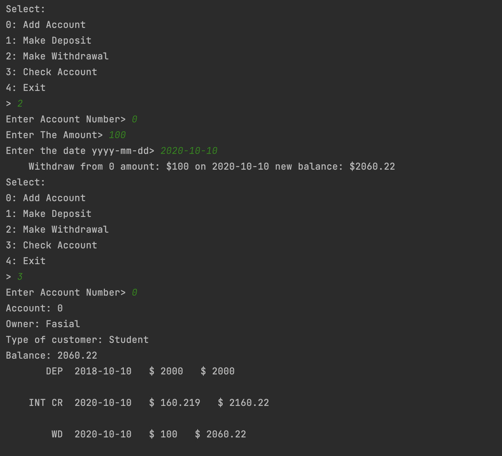
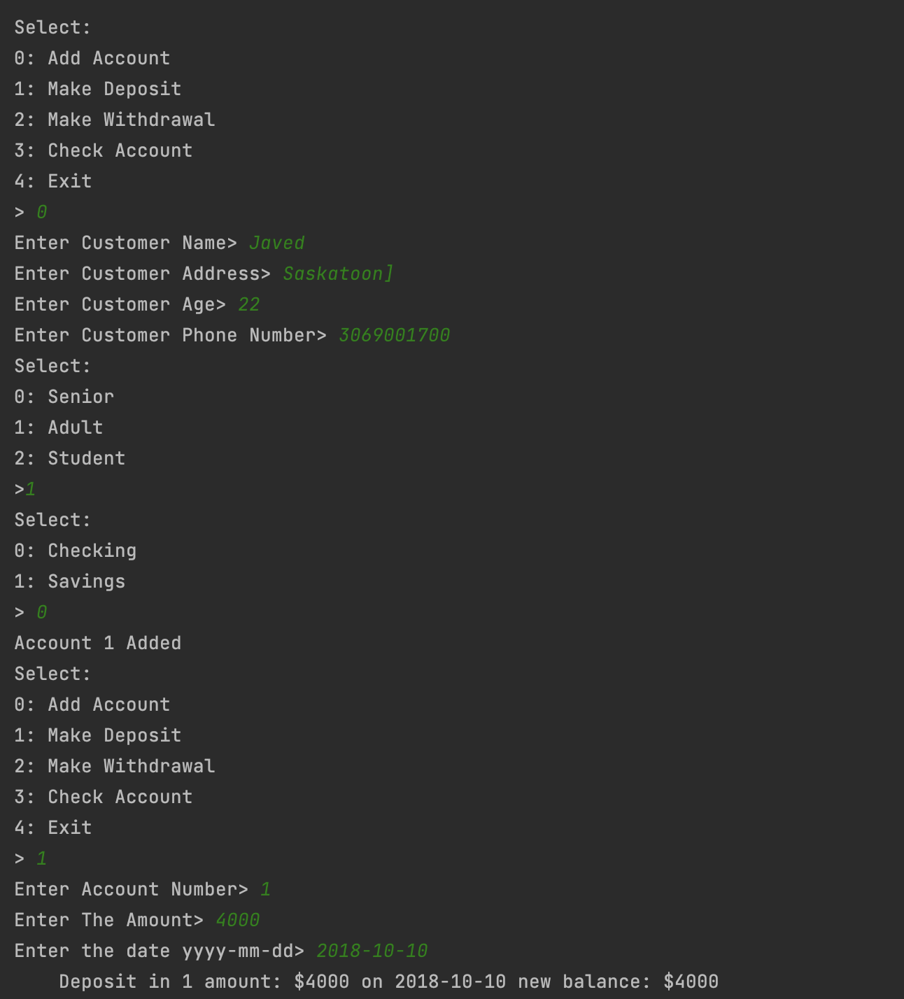
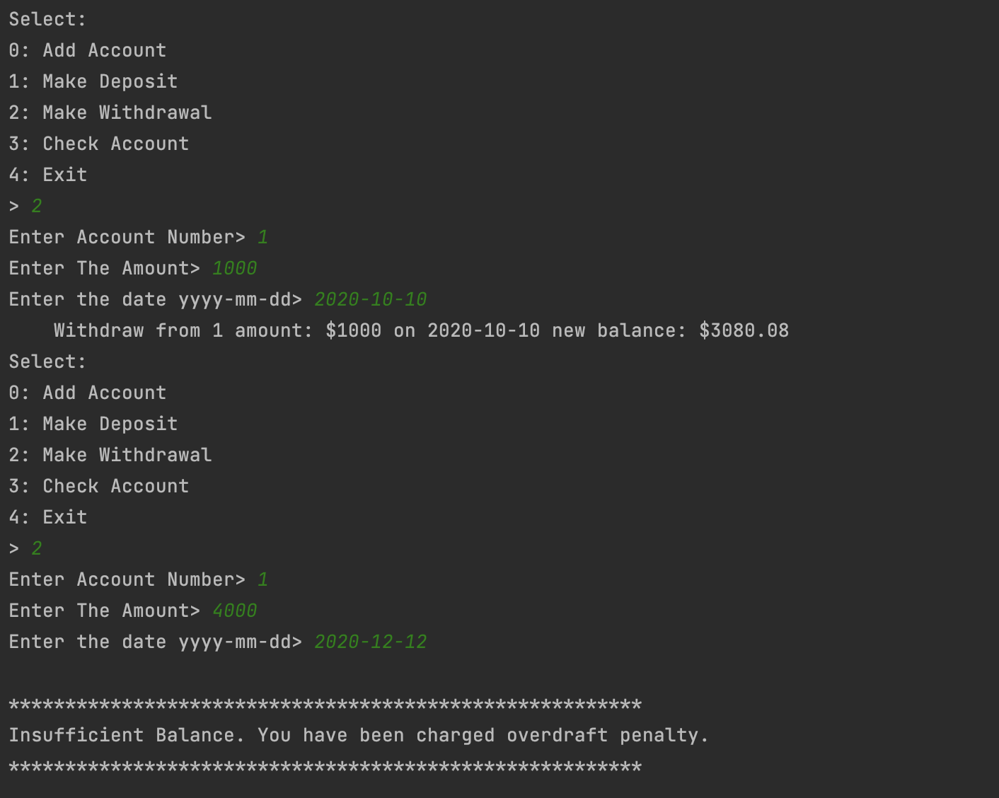
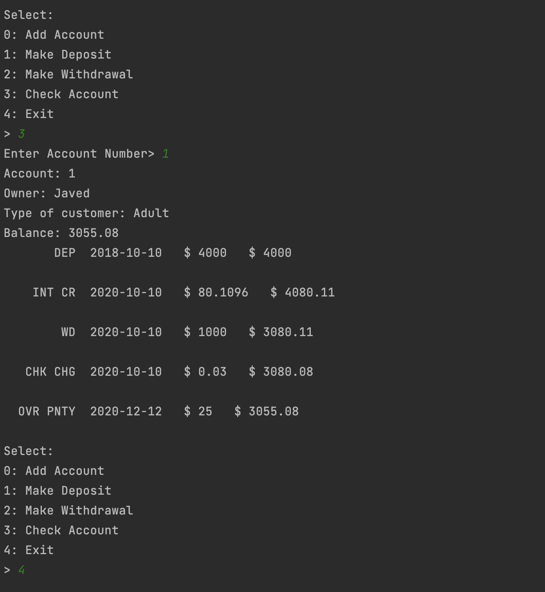

# CS-700 Assignment 3

## Getting Started
#### This assignment contains a program to create a banking system application which adds account, deposit money, withdraw money and display account details. 

### 1. Main file.
### Contents -
1. [Main CPP File](main.cpp)
### Usage - 
#### Running the main() function the bank system application.
  
### 2. Banking application  - 
#### Contents - 
        i. customer.cpp
        ii. customer.h
        iii. Date.cpp
        iv. Date.h
        v. transaction.cpp
        vi. transaction.h
        vii. account.cpp
        viii. account.h
        ix. BankApplication.cpp
        x. BankApplication.h
        xi. bank.cpp
        xii. bank.h
### Usage - 
#### Running this program will allow you to add accounts, make deposit, withdraw money, get interest and check all the transactions with your details.
### Output - 
1. Console output
      
      
      
      
      
